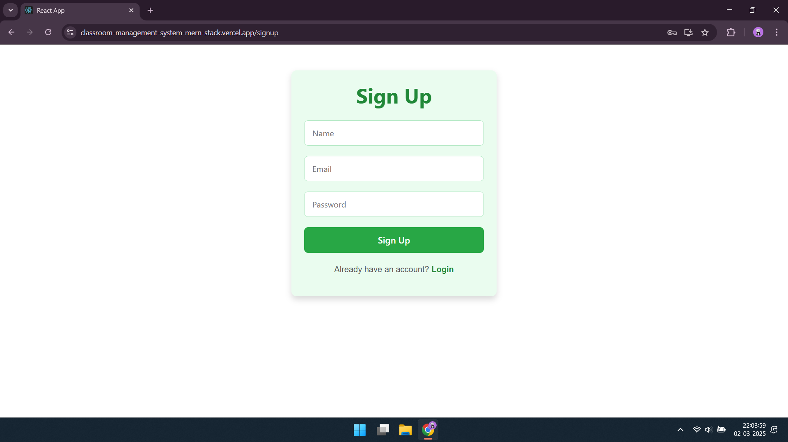
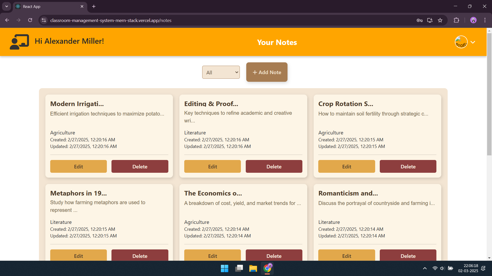
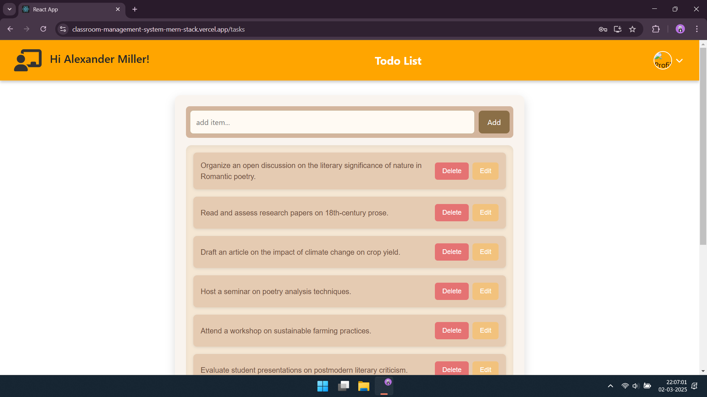
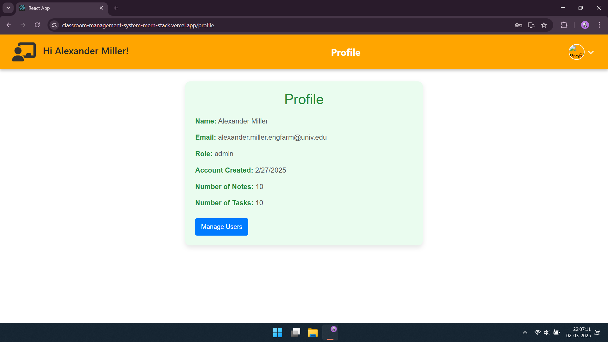

# 🎓 Classroom Management System  

## 📌 Project Overview  

The **Classroom Management System** is a **MERN stack** web application designed to streamline class management. It allows teachers (**admins**) to manage students efficiently through a dashboard where they can **add, edit, and remove users, notes and tasks**. Students can access their profiles and use integrated tools like **Notes and a To-Do List** to stay organized.  

---

## 🚀 Features  

✅ **User authentication** (Signup/Login)  
✅ **Profile management** with profile picture upload  
✅ **Notes and To-Do List** applications for students  
✅ **Admin dashboard** for managing students  
✅ **View, Add, Edit, Delete all users data, notes and tasks**  
<!---✅ **Responsive and user-friendly UI**-->  

---

## 🛠️ Tech Stack  

### **Frontend**  
- React.js  
- Context API  
- CSS3 and Bootstrap CSS

### **Backend**  
- Node.js  
- Express.js  

### **Database**  
- MongoDB

### **Authentication**  
- JWT (JSON Web Tokens)  

### **Hosting**  
- **Frontend:** Vercel  
- **Backend:** Render  

---

## 📸 Screenshots  

1️⃣ **Home Page** – Shows login/signup options.  
     

2️⃣ **Signup Page** – User registration for new accounts.  
     
   
3️⃣ **Login Page** – User authentication.  
     

4️⃣ **User Dashboard** – Displays options like Notes & To-Do List.  
   

5️⃣ **Notes Page** – View and manage user notes.  
    

6️⃣ **To-Do List Page** – View and manage to-do tasks. 
 

7️⃣ **Profile Page** – Allows users to manage and update their profile information.
 

8️⃣ **Admin Panel** – Overview of all users.  
     

9️⃣ **Add User Modal** – Popup form to add a new user.  
     

🔟 **Edit User Modal** – Form to edit user details.  
     

1️⃣1️⃣ **Delete Confirmation Modal** – Prompt before deleting a user.  
     

---


## ⚡ Installation & Setup  

### 1️⃣ Clone the Repository  

```sh
git clone https://github.com/your-username/classroom-management-system.git
cd classroom-management-system
```

### 2️⃣ Install Dependencies  

#### Frontend  

```sh
cd frontend
npm install
```

#### Backend  

```sh
cd backend
npm install
```

### 3️⃣ Environment Variables  

Create a `.env` file in the `backend` folder and add:  

```sh
MONGO_URI=your_mongodb_connection_string
JWT_SECRET=your_jwt_secret_key
```
### 4️⃣ Run Code  
This  starts both frontend and backend using Concurrently

```sh
cd ..
npm run both
```

---

## 🌍 Live Demo  

🔗 **Frontend and Backend:** [https://classroom-management-system-mern-stack.vercel.app/](https://classroom-management-system-mern-stack.vercel.app/)  

_(Replace `#` with actual deployed links.)_  

---

## 🔥 Test User Details

Use these login details to see the workings of the project

Username: takeshi.nakamura.ee@univ.edu
Password: mypassword123

Admin Username: alexander.miller.engfarm@univ.edu
Password: mypassword123

--

## 🔥 Future Improvements  

🚀 **More Role-based access control**  
📊 **Enhanced analytics dashboard**  
🗓️ **Additional integrations** (Calendar, Chat system) 

---


## 💡 Contributing  

Contributions are welcome! Feel free to fork the repository and submit a **pull request**.  

---
