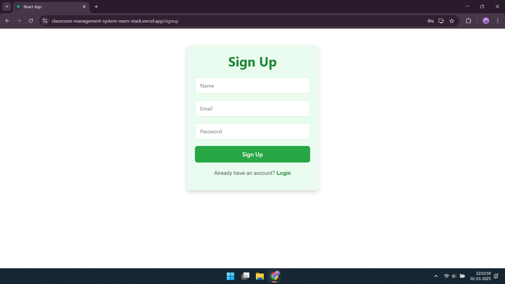
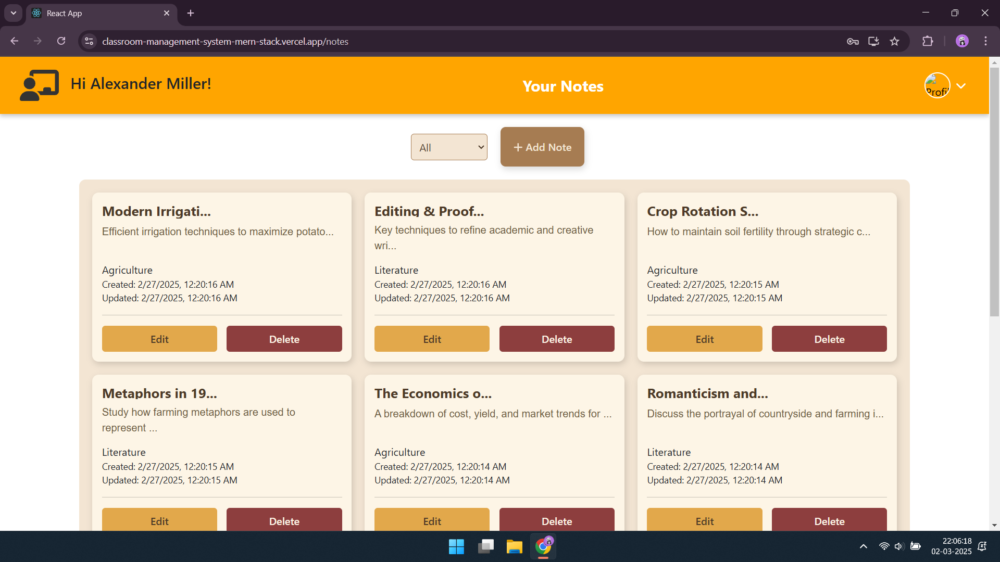
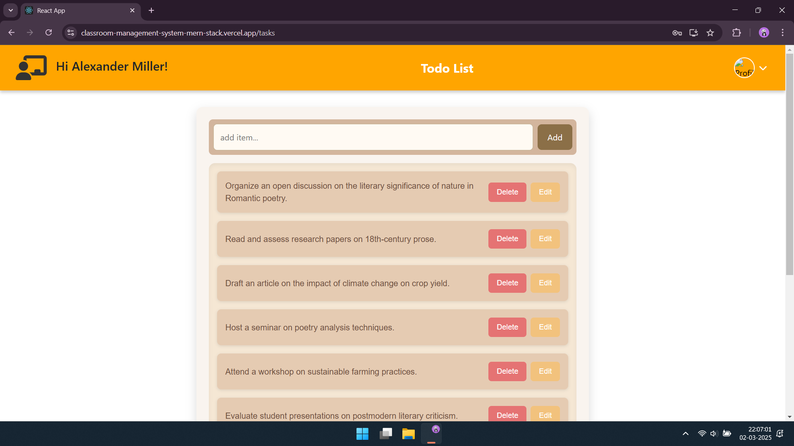
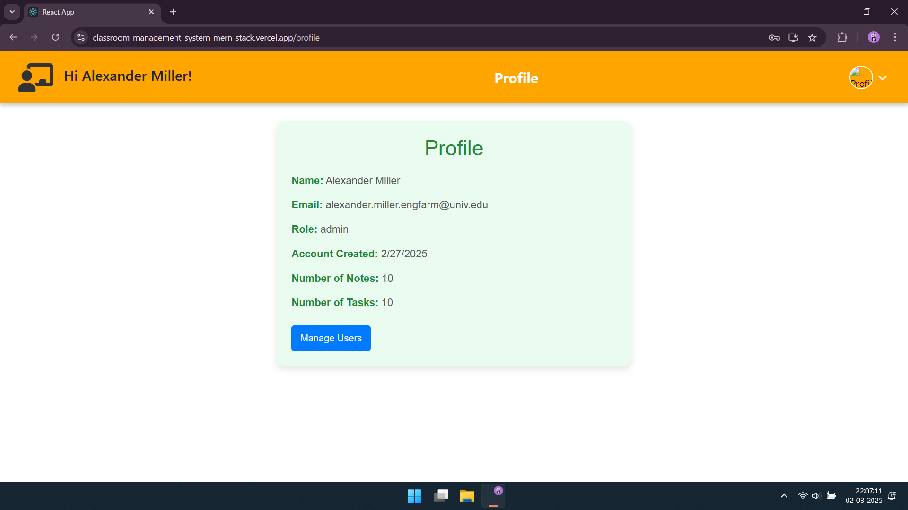
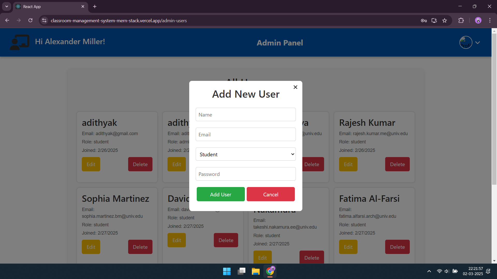

1️⃣ **Home Page** – Shows login/signup options.  
     

2️⃣ **Signup Page** – User registration for new accounts.  
     
   
3️⃣ **Login Page** – User authentication.  
     

4️⃣ **User Dashboard** – Displays options like Notes & To-Do List.  
   

5️⃣ **Notes Page** – View and manage user notes.  
    

6️⃣ **To-Do List Page** – View and manage to-do tasks. 
 

7️⃣ **Profile Page** – Allows users to manage and update their profile information.
 

8️⃣ **Admin Panel** – Overview of all users.  
     

9️⃣ **Add User Modal** – Popup form to add a new user.  
     

🔟 **Edit User Modal** – Form to edit user details.  
     

1️⃣1️⃣ **Delete Confirmation Modal** – Prompt before deleting a user.  
     
